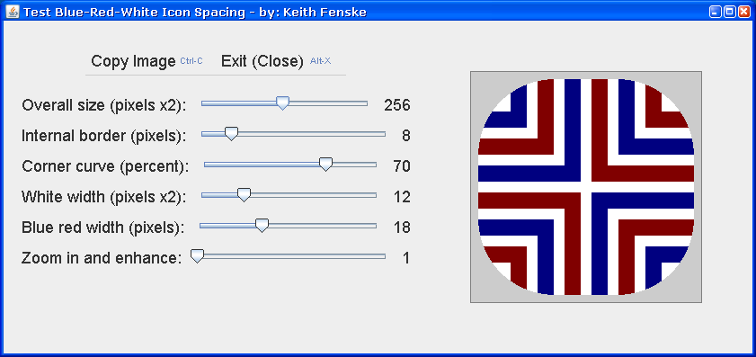

### Blue Red White (Java)

by: Keith Fenske, https://kwfenske.github.io/

BlueRedWhite is a Java 1.4 graphical (GUI) application to test the size and
spacing of alternating blue and red lines on a white background, as used by
icons for the "Hex Byte Char" application. Medium blue and medium red are
strong colors when placed near each other. Separating them with white creates
different effects depending upon how wide the lines are.

This program is of interest to graphic artists and Java programmers. There are
several limitations. The GUI layout is low effort. Sliders are approximate when
moved with a mouse; arrow keys are more precise, and a dialog box with an exact
number would be better. The basic design assumes an even number of pixels (that
is, a multiple of two) for icon sizes and the width of the white lines, which
is not enforced in an obvious manner.

Download the ZIP file here: https://kwfenske.github.io/blue-red-white-java.zip

Released under the terms and conditions of the Apache License (version 2.0 or
later) and/or the GNU General Public License (GPL, version 2 or later).

